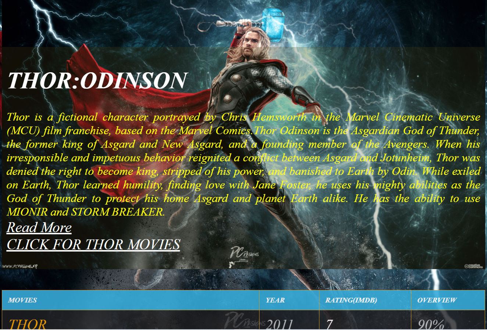

***This new Web application is created by Ankita Sikder and Biswarup Bhattacharjee, students of BTECH, in University of Engineering and Management, Kolkata.***

***Email Id: ankita.sikder14@gmail.com.***

# BASIC-AVENGERS :star_struck: :open_mouth: :sunglasses: :facepunch:

  

## About :point_down:

     
Everyone loves AVENGERS. The Avengers were a team of extraordinary individuals, with either superpowers or other special characteristics. Its purpose was to protect global stability from inner or extraterrestrial threats. Though primarily affiliated with the United States of America, they worked with the peaceful interests of the whole world in mind rather than a specific country or organization. The Avengers were first assembled by S.H.I.E.L.D. Under Captain America's leadership, the team completed several operations around the world with success. The story evolves till Thanos and his army had followed them, sparking the immense Battle of Earth, where Iron Man gave his life to defeat Thanos and his army. With the battle won and over, the Avengers disbanded. This web application contains 52 web pages on avengers characters including heroes and villains. Marvel studious' animation is played at the beginning. Each pages contains different designs. The fans of mcu AVENGERS always want to explore about characters and the film series. So it is a great chance for them to easily and also explore the world of avengers very fast and efficiently without searching in google or any social media.

***LINK : :point_right: https://ankitasikder.github.io/AVENGERS-MARVEL/.*** 

## Why I have made this :point_down:

I have assembled all details and various interesting things about Avengers characters and films. We all know how kids are crazy about superheroes and how they fascinate themselves to be one of them. Avengers is a team of superheroes from the Marvel Universe in the Marvel’s Comic series. There are many Avengers like Iron Man, Doctor Strange, Hulk, Spider-Man, Black Widow, Thor and many others who aimed to save the universe from evils and villains like Thanos, Ultron and Loki. So I have made this for those fans and also who want to know about them. This web application has many exciting and interesting facts about Avengers.

## Some Resources of this project :point_down:

     
I have used basic concepts of web development to make this web application. I have used HTML5, CSS3 and JAVASCRIPT only. I have used slider, card, polaroid, table, figure, row column concepts for designing. I have used animations for text, slideshow designing.  
I have used _[marvel fandom wiki]_(https://marvelcinematicuniverse.fandom.com/wiki/Marvel_Cinematic_Universe) for references of every avengers' characters. In the home page in marvel studious I have used this link for _[avengers' bio]_(https://www.marvel.com/characters).I have used _[hotstar]_(https://www.hotstar.com/in) for movie links.

     
## Some Screenshots of this project :point_down:

     
 

 

 

 

 

